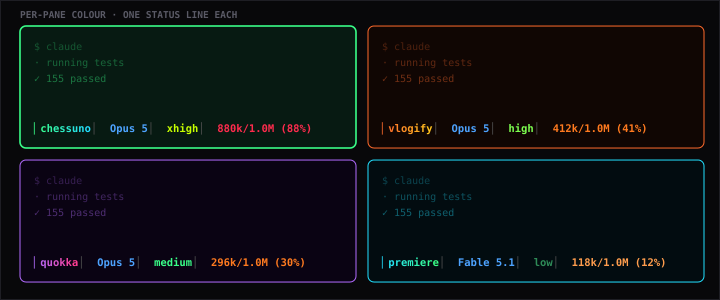
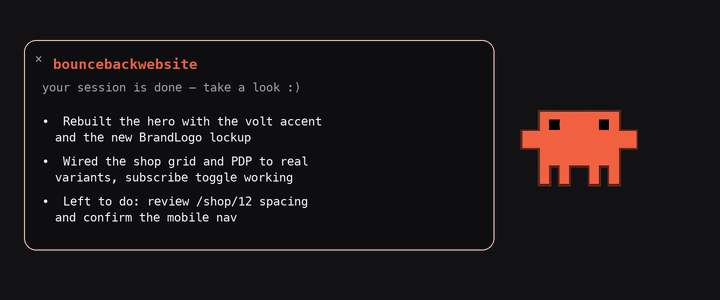
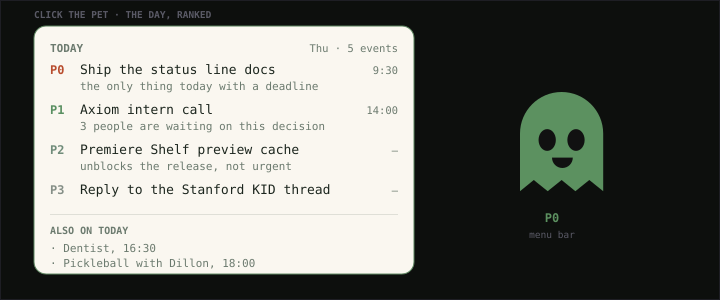
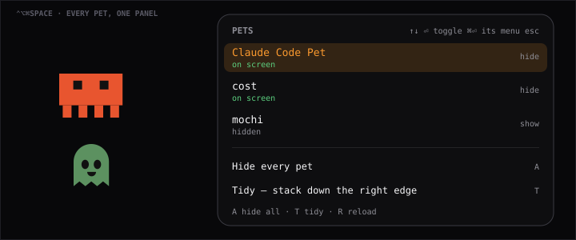
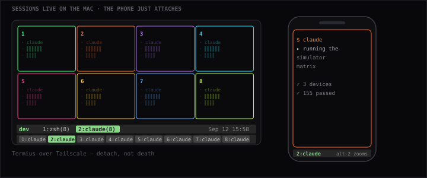
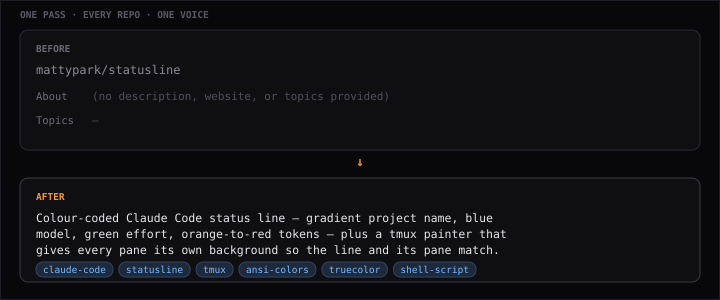

# Things you can install

Tools I built because I needed them, and kept because other people did too.
Every one runs on your own machine — no account, no server, no telemetry.

<table>
<tr>
<td width="50%">

**[statusline](https://github.com/mattypark/statusline)** — a Claude Code status line that's colour-coded by meaning, plus a tmux painter so each pane and its line share a colour. Shell · tmux · ANSI

</td>
<td width="50%">

**[Claude Code Pet](https://github.com/mattypark/claudeaiagentreminderguy)** — a desktop pet that tells you when a Claude session finishes and what it actually did. Hammerspoon · Lua

</td>
</tr>
<tr>
<td width="50%">

**[costpriority](https://github.com/mattypark/costpriority)** — click the pet, get your day ranked P0–P3 with a reason for each. Reads your Mac's own calendar; nothing leaves the machine. Hammerspoon · EventKit

</td>
<td width="50%">

**[organizepet](https://github.com/mattypark/organizepet)** — one hotkey to see and control every desktop pet you have. Hide all, tidy, reload. Hammerspoon · Lua

</td>
</tr>
<tr>
<td width="50%">

**[Claude Code: Mac → iPhone](https://github.com/mattypark/Claudemacbooktoiphone)** — run Claude Code on your Mac, drive it from your phone. Closing the app detaches; it never kills the work. tmux · SSH · Tailscale

</td>
<td width="50%">

**[describatory](https://github.com/mattypark/describatory)** — reads your actual code and rewrites every repo's About line and topics in one voice. Reviewed before anything is pushed. Claude Code · gh CLI

</td>
</tr>
</table>

Cards regenerate with <code>python3 scripts/generate-work-cards.py</code> — every colour and measurement in them is read out of the tool's own source.

 

## The bigger things

I'm 15. I started building before I was old enough to have a job, and the plan
was never to wait — not for permission, not for a degree, not for someone to
call me qualified. So I built an audience, then a nonprofit, then the tools I
wished existed, and shipped every one of them in public.

| | |
|---|---|
| [**Axiom Pathways**](https://github.com/mattypark/Nonprofitwebsite) | The nonprofit I founded and run. Chapters teaching AI, CS, and startups to high schoolers. Stanford KID partner, intern-run, recently pitched to 30+ angel investors. |
| [**Baseline**](https://github.com/mattypark/baseline-fitness) | AI-memory training and fuel dashboard. Tell it something once; it remembers and auto-fills the rest. |
| [**Bery**](https://github.com/mattypark/forpeopletorememebr) | Personal CRM for actually remembering people. Describe someone in a sentence, get a filled-in profile back. |
| [**Premiere Shelf**](https://github.com/mattypark/premierepropreview-PPP-) | Every Premiere project on your Mac on one wall — hover to play, click for the transcript and the grade. |

[All repositories →](https://github.com/mattypark?tab=repositories)

 

## Writing

I write about what actually happened — the prep, the nerves, the days it didn't land.

| Post | On |
|---|---|
| [**Pitching Axiom to 30+ angel investors**](https://www.linkedin.com/feed/update/urn:li:activity:7480960385735610368/) | Why confidence and a content portfolio move a room more than the deck does — even when you're pitching a nonprofit. 95 reactions · 40 comments |
| [**Hitting 10K on Instagram in 3 months**](https://www.linkedin.com/feed/update/urn:li:activity:7479676181009604608/) | I hit the milestone and felt horrible. On comparison anxiety, and how the goalpost moves the second you reach it. 86 reactions · 39 comments |
| [**Stanford ASES Launchpad**](https://www.linkedin.com/feed/update/urn:li:activity:7455008428919386113/) | Flew Kentucky to California on a school day. Most decisions are reversible, so act. 44 reactions · 16 comments |

 

## Elsewhere

**30M+ views · 75K+ followers.** Built the audience before the résumé.

[matthewnpark.com](https://matthewnpark.com) · [X](https://twitter.com/MattyparkW) · [LinkedIn](https://linkedin.com/in/mattypark) · [Instagram](https://instagram.com/mattypark) · [YouTube](https://youtube.com/@mattypark)
